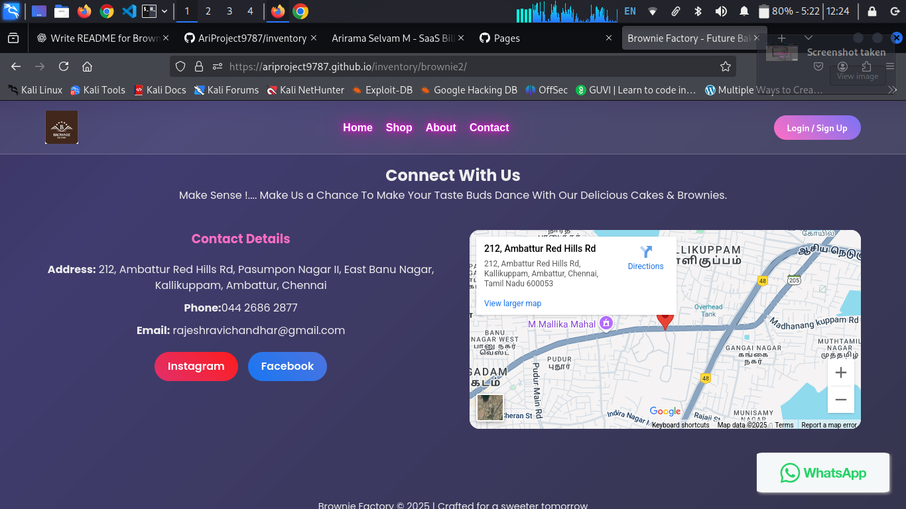
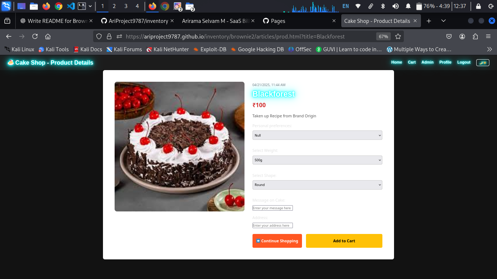

## 📌 Project Overview

This project is a fully functional online food ordering and billing system designed to bring the best of web and mobile technology to the food industry. Built using modern front-end techniques and connected to a dynamic backend, the system integrates features like:

- Responsive product catalog with live inventory
- Order tracking and smart suggestions
- Integrated billing and payment system
- Admin and staff panel for inventory & order management & billing
- Firebase backend for real-time updates


---

## 🧰 Tech Stack

| Layer        | Technologies Used                                   |
|--------------|------------------------------------------------------|
| Front-End    | HTML5, CSS3, JavaScript |
| Back-End     | Firebase Realtime Database, Google Apps Script        |
| Automation   | Google Sheets API, Firebase Functions (optional)      |
| Tools Used   | Google Analytics     |

---

## 🚀 Features

- 🔍 Smart search and product filtering
- 🛒 Dynamic product listing and cart system
- 💸 Instant billing and invoice generation
- 📦 Live order tracking system
- 📱 Mobile-responsive layout
- 📊 Sales report generation using Google Sheets
- 🔐 Staff/admin login panel with access control

---

## 💻 Installation & Setup

### 1. Clone the Repository

```bash
git clone https://github.com/AriProject9787/inventory
cd inventory
```
2. Firebase Setup

    Create a new project at Firebase Console

    Enable Realtime Database

    (Optional) Enable Authentication

    Copy your Firebase config and paste it into js/firebase.js

3. Run Locally

    Open index.html in your browser

    Ensure Firebase credentials and dependencies are correctly linked

4. (Optional) Google Apps Script Integration

    Link with a Google Sheet to log orders or generate reports

    Deploy your Apps Script as a Web App

    Connect via AJAX from your website


## 🧪 Screenshots

Add your screenshots inside a `screenshots/` folder and use the following syntax:

- **Index Page:**
    
  

- **Login Page:**  
  

- **Home Page:**  
  

- **Product Page:**  
  

- **Cart Page:**  
  

- **Admin Page:**  
  

- **Billing Page:**  
  

- **Generated Bill:**  
  


📈 Future Enhancements

- 🎙️ Voice assistant integration (e.g., “Hello Echo” wake word)

- 💳 Integration with payment gateways (e.g., Razorpay, PayPal)

- 📱 Progressive Web App (PWA) support

- ⭐ Customer reviews and loyalty points system

- 🤖 AI chatbot for automated customer support

🤝 Contributors

- Arirama Selvam – GitHub

- Special thanks to testers and supporters from Dr. G.U. Pope College of Engineering

📞 Contact

- Email: ariofficial9787@gmail.com

- Portfolio: https://ariproject9787.github.io/portfolio/

- LinkedIn: https://www.linkedin.com/in/ariramaselvam
